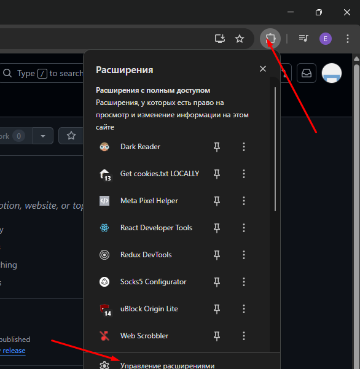
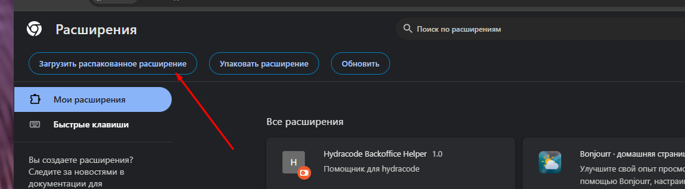

# Гидрасос Задний Офис Помощник

## Нахуя и зачем?
Что-бы ты спросил. 

А вообще, штука крайне полезная, помогает вычислять спамеров, ебать их в сраку, а так-же выполнять задания от КАМов по вычислению среднего времени обработки платежей

## ЗАТКНИСЬ И ВОЗЬМИ МОИ ДЕНЬГИ
* Скачивай расширение, распакуй архив куда-нибудь, и переходи в управление расширениями в Chrome

* Жми "Загрузить распакованное расширение"

* В открывшемся окне выбора перейди в папку с только-что скачанным расширением, и нажми "Выбор папки"
* Вуаля. Помощник для гидрасоса установлен
* Теперь открой гидрасос, добавь в репорт колонку Customer Reference Id и наслаждайся никому не нужными инструментами
